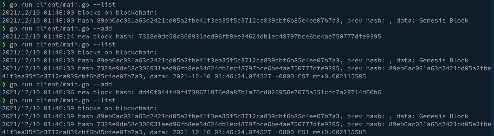

# Blockchain with gRPC in Golang

## Goal
Use gRPC to build a simple blockchain service

## Function
- gRPC Server
build a gRPC blockchain Server to provide service to client,
    eg. Add Block to blockchain, get block from blockchain.

- gRPC Client use command to interact with blockchain gRPC server.

## How to use

run grpc server:
- go run server/main.go

open another terminal, run client with flag:
- go run client/main.go --list (check blocks on blockchain)
- go run client/main.go --add (add a new block on blockchain, input data is current time)

if work, there will show the information of blockchain from client.

Demo  

## Step

- write proto file of blockchain.
- install proto-gen-go && protoc-gen-go-grpc, ref. [gRPC.io](https://grpc.io/docs/languages/go/quickstart/)
- make sure already installed protobuf compiler (protoc) version 3+
- under the folder of proto file, use cmd to generate .go file.
- run cmd follow by these :
 protoc --go-grpc_out=. --go-grpc_opt=paths=source_relative *.proto
 protoc --go_out=. --go_opt=paths=source_relative *.proto 
- use the generated pb.go file to implement server.

## Note

- proto-gen-go : contains that code for the serialization/deserialization of protobuf messages.

- protoc-gen-go-grpc: contains the code for gRPC Server and Client

## 
After run these commad, will generate 2 files :

- blockchain_grpc.pb.go: contains BlockchainServer and BlockchainClient interface,
can use it to build business logic on server
- blockchain.pb.go: contains data struct of Block, 

## more detail --> [note](note.md)
